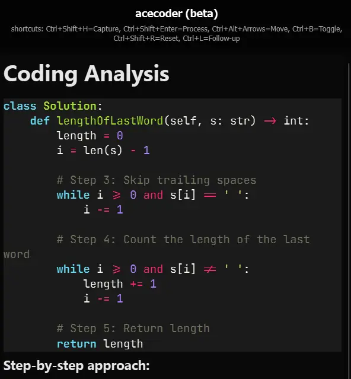

# AceCoder (Open-sourced)

Inspired by [Interview Coder](https://github.com/ibttf/interview-coder) by @ibttf

An app that does this shouldn't be locked behind a $60/mo paywall.

AceCoder is a **desktop AI assistant for Windows and macOS** designed to help you with a wide range of questions and tasks presented visually (e.g., in screenshots). It captures screen areas, sends them to an AI model via OpenRouter for analysis, and displays the results in a convenient, minimal overlay window.

This project is licensed under the **GNU General Public License v3.0**. See the `LICENSE` file for details.

**Note:** This application supports **Windows and macOS**.

<p align="center">
  
</p>

## Key Features

*   **Screenshot Capture:** Capture one or more screenshots of coding problems or code snippets using a hotkey.
*   **AI Analysis:** Sends captured images to a powerful AI model (configurable, defaults to a Gemini model via OpenRouter) for explanation and solution generation.
*   **Overlay Interface:** Displays the AI's response in a persistent, always-on-top overlay window.
*   **Markdown Rendering:** Formats the AI's response using Markdown, including syntax highlighting for code blocks.
*   **Follow-up Questions:** Ask follow-up questions about the provided solution directly within the overlay (uses the previous analysis as context).
*   **Configurable Hotkeys:** Control capture, processing, overlay visibility, and movement with global hotkeys.
*   **Capture Exclusion:** The overlay window attempts to exclude itself from screen captures (effectiveness may vary by OS and capture method).

## Planned Features

- [ ] **Click-through Overlay:** Allow mouse interactions with windows underneath the overlay.
- [ ] **Optional Follow-up Suppression:** Ability to type in follow-up window without losing focus of current window.

## Keybindings

*   **`Ctrl + Shift + H`** (Configurable: `HOTKEY_CAPTURE`): Capture a screenshot. Press multiple times to capture multiple images for a single analysis.
*   **`Ctrl + Shift + Enter`** (Configurable: `HOTKEY_PROCESS`): Process the captured screenshot(s) and send for AI analysis (standard mode).
*   **`Alt + Shift + Enter`** (Configurable: `HOTKEY_PROCESS_FAST`): Process the captured screenshot(s) using the faster model and skipping content detection (fast mode).
*   **`Ctrl + B`** (Configurable: `HOTKEY_TOGGLE_VISIBILITY`): Toggle the visibility of the overlay window.
*   **`Ctrl + Alt + Arrow Keys` (Left/Right/Up/Down)** (Configurable: `HOTKEY_MOVE_LEFT`, etc.): Move the overlay window around the screen.
*   **`Ctrl + Shift + V`** (Configurable: `HOTKEY_TOGGLE_CAPTURE_VISIBILITY`): Toggle whether the overlay window itself appears in screen captures.
*   **`Ctrl + Shift + R`** (Configurable: `HOTKEY_RESET_SCREENSHOTS`): Reset (clear) the currently captured screenshots.
*   **`Ctrl + L`** (Configurable: `HOTKEY_FOLLOW_UP`): Open the follow-up input area at the bottom of the overlay (only works after an initial analysis).
*   **`Ctrl + Shift + F`** (Configurable: `HOTKEY_FOCUS_OVERLAY`): Attempt to bring the overlay window to the front.

## Installation

1.  **Clone the repository:**
    ```bash
    git clone https://github.com/safzanpirani/acecoder-open.git
    cd acecoder-open
    ```

2.  **Create and activate a virtual environment:**
    *   **Windows (Command Prompt):**
        ```bash
        python -m venv venv
        .\venv\Scripts\activate
        ```
    *   **Windows (PowerShell):**
        ```powershell
        python -m venv venv
        .\venv\Scripts\Activate.ps1
        ```
    *   **macOS / Linux (Bash/Zsh):**
        ```bash
        python3 -m venv venv
        source venv/bin/activate
        ```

3.  **Install dependencies:**
    ```bash
    pip install -r requirements.txt
    ```
    *(This will automatically install the correct dependencies for your operating system)*

4.  **(Optional) Install Recommended Font:** For the best visual experience, it is recommended to install the [JetBrains Mono](https://www.jetbrains.com/lp/mono/) font, which is used by default in the overlay.

## Configuration

AceCoder uses a `config.py` file to manage settings and requires an API key from **OpenRouter.ai** to function. OpenRouter provides access to various AI models, including free ones (rate limits apply).

1.  **Get an OpenRouter API Key:** Sign up at [https://openrouter.ai/](https://openrouter.ai/) and generate an API key.
2.  **Set the Environment Variable:** You **must** set the `OPENROUTER_API_KEY` environment variable before running the application. *Alternatively, you can hardcode the key directly in `config.py`, but this is **not recommended** for security reasons.*

    *   **Windows (Command Prompt - Temporary):**
        ```cmd
        set OPENROUTER_API_KEY=your_actual_api_key_here
        python main.py
        ```
    *   **Windows (PowerShell - Temporary):**
        ```powershell
        $env:OPENROUTER_API_KEY="your_actual_api_key_here"
        python main.py
        ```
    *   **macOS / Linux (Bash/Zsh - Temporary):**
        ```bash
        export OPENROUTER_API_KEY='your_actual_api_key_here'
        python3 main.py 
        ```
    *   **Permanent (Windows):** Search for "Edit the system environment variables" in the Start menu, click "Environment Variables...", and add `OPENROUTER_API_KEY` with your key as the value under "User variables". You may need to restart your terminal or PC for the change to take effect.
    *   **Permanent (macOS / Linux):** Add `export OPENROUTER_API_KEY='your_actual_api_key_here'` to your shell profile file (e.g., `~/.bashrc`, `~/.zshrc`, `~/.profile`) and restart your shell or source the file (`source ~/.bashrc`).

    **Important:** Keep your API key secure and do not commit it directly into the code or share it publicly.

3.  **(Optional) Configure OpenRouter Referrer/Title:** You can optionally set `OPENROUTER_REFERRER_URL` and `OPENROUTER_SITE_TITLE` environment variables if you want to identify traffic from your app in OpenRouter analytics (use the same methods as above to set them, or modify `config.py`).

4.  **Review `config.py`:** Open the `config.py` file in the project root. Here you can adjust:
    *   **AI Models:** Change `DEFAULT_MODEL_NAME`, `DETECTION_MODEL_NAME`, and `FAST_MODEL_NAME` to use different models available on OpenRouter.
    *   **Fast Mode Content Type:** Set `FAST_MODE_DEFAULT_CONTENT_TYPE` to the expected content type when skipping detection.
    *   **API Parameters:** Modify `DEFAULT_TEMPERATURE`, `DEFAULT_MAX_TOKENS`, `DEFAULT_RETRY_COUNT`, `DEFAULT_TIMEOUT`.
    *   **Application Settings:** Adjust `MAX_LOG_SIZE_MB`, `SCREENSHOT_DELAY_MS`, `OVERLAY_MOVEMENT_STEP`.
    *   **Hotkeys:** Change the key combinations for various actions (`HOTKEY_CAPTURE`, `HOTKEY_PROCESS_FAST`, etc.). *Note: Be mindful of potential key conflicts and platform differences (e.g., 'enter' vs '<enter>').*
    *   **Mock Mode:** Set `MOCK_MODE = True` for UI testing without API calls.

### Changing the AI Model

AceCoder uses OpenRouter, giving you access to a variety of AI models. To change the model used for analysis:

1.  Open the `config.py` file.
2.  Locate the model settings (`DEFAULT_MODEL_NAME`, `DETECTION_MODEL_NAME`, `FAST_MODEL_NAME`).
3.  Replace the model string (e.g., `"google/gemini-flash-1.5"`) with the desired model identifier from [OpenRouter Models](https://openrouter.ai/models). Ensure you choose a model compatible with multimodal inputs (image and text).
4.  You might also want to adjust `DEFAULT_MAX_TOKENS` depending on the chosen model's limits.

## Usage

1.  Ensure the `OPENROUTER_API_KEY` environment variable is set or configured in `config.py` (see Configuration).
2.  Activate your virtual environment (see Installation).
3.  Review and adjust settings in `config.py` if desired.

## License

This project is licensed under the **GNU General Public License v3.0**. A copy of the license should be included in the file `LICENSE`.

Under the GPLv3, you are free to use, modify, and distribute this software, provided that you also distribute the source code of any derivative works under the same GPLv3 license.

## Contributing

Contributions are welcome! Please feel free to open issues for bugs or feature requests, or submit pull requests.